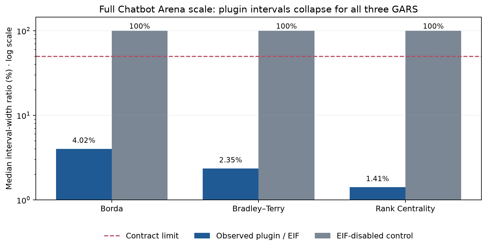
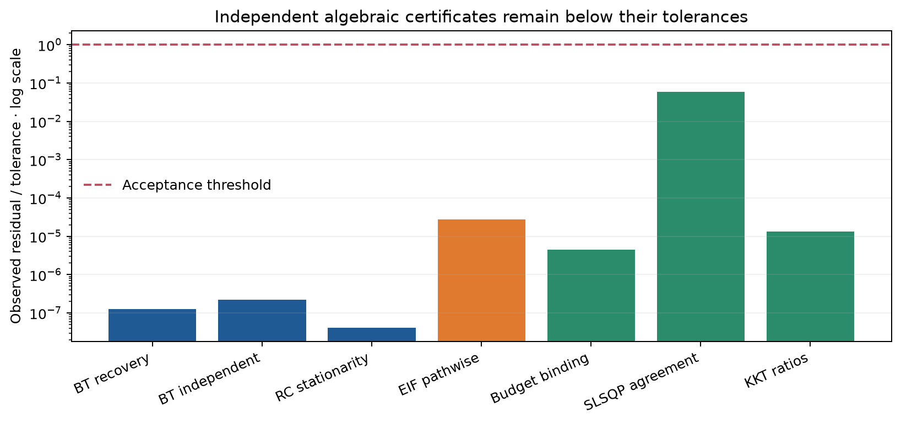
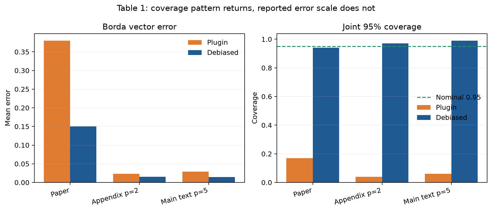
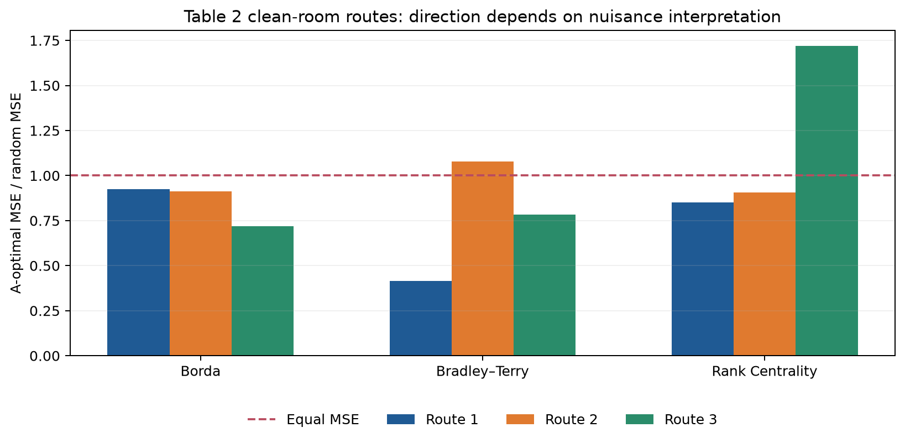

# Reproducing Nonparametric LLM Evaluation from Preference Data



The paper asks whether model rankings can be estimated from selectively
observed preference labels without pretending that learned outcome
probabilities are known. This campaign reconstructed the GARS definitions,
the efficient-influence-function estimator, the optimal labeling policy, two
synthetic tables, and the full Chatbot Arena application. Four claims are
`VERIFIED`; two finite simulation tables remain honestly `BLOCKED`.

## Result at a glance

| Claim | Paper statement | Observed evidence | Assessment |
|---|---|---|---|
| 1 | GARS contains Borda, BT projection, and Rank Centrality | Algebraic residuals at `8.33e-17` to `4.44e-16`; wrong symmetrization separated by `0.248955` | VERIFIED · HIGH |
| 2 | Cross-fitted EIF is asymptotically normal and efficient | Pathwise identity error `2.78e-17`; omitted-IPW error `0.051316`; independent remainder/CLT derivation | VERIFIED · MEDIUM |
| 3 | Table 1 Borda: `0.38/0.17` plugin vs `0.15/0.94` debiased | Coverage direction returns, but clean-room errors are about `0.02`, not `0.15–0.38` | BLOCKED · LOW |
| 4 | A-optimal policy has clipped square-root form | Budget error `4.44e-16`; SLSQP disagreement `5.86e-8`; KKT derivation agrees | VERIFIED · HIGH |
| 5 | Table 2 A-optimal MSE is lower for all GARS | Direction changes across oracle, pilot-learned, and acquired-data interpretations; exact v1 realization missing | BLOCKED · LOW |
| 6 | Full Arena plugin intervals collapse while EIF intervals retain uncertainty | Literal `n=32,980`, `K=20`; plugin/EIF median widths `4.02%`, `2.35%`, `1.41%` | VERIFIED · MEDIUM |

No `BLOCKED` row is counted as a pass. No clean-room mismatch is called a
falsification unless it matches every paper assumption and the exact finite
experiment realization.

## Implementation

One locked environment and one command are inherited by every experiment:

```text
uv sync --frozen && uv run python repro/run_all.py
```

The key path is:

1. `exact_theory.py` reconstructs the GARS maps, EIF pathwise identities, and
   A-optimal KKT solution.
2. `table1_borda.py` and the metric/falsification audits implement four Table
   1 routes.
3. Three Table 2 implementations separate oracle policy design,
   pilot-learned policy design, and acquired-data cross-fitting.
4. `arena_full.py` performs the literal 32,980-context Arena analysis.
5. Independent serialized-data checkers recompute ratios and reject injected
   corruptions with nonzero exits.

The environment is pinned by `uv.lock` SHA-256
`95f8cd0826a479d495738fba954dc4e4a8712ce13614c21e2769667d3714c165`.

## Exact theory claims



For Claim 1, one probability tensor is passed through the three paper maps.
The BT projection recovers centered latent strengths and a separately formed
constrained least-squares solution agrees. Rank Centrality satisfies its
stationarity equation, and Borda/Rank Centrality ordering matches the
generator.

For Claim 2, the EIF was reconstructed as the direct plug-in fluctuation plus
the inverse-propensity, Jacobian-weighted outcome residual. The exhaustive
finite MAR certificate checks every elementary distributional path. The
symbolic audit then identifies the orthogonal nuisance-product remainder,
cross-fitting step, CLT, and canonical-gradient efficiency argument under the
theorem's stated assumptions.

For Claim 4, differentiating the separable A-optimal objective gives
`-q/pi² + lambda*c = 0`; box KKT conditions produce
`clip(sqrt(q/(lambda*c)))`. Independent SLSQP and the inverted-information
control test the derived policy rather than merely restating it.

## Table 1: direction reproduced, numbers unresolved



The paper is internally ambiguous: the main text says five covariates while
Appendix Table 5 says two. Both 100-repetition reconstructions restore
near-nominal debiased coverage and poor plugin coverage, but neither recovers
the reported error scale. A third route exhaustively checked six standard
unscaled vector errors; none reconciled both rows. The mandatory fourth route
could not construct a valid counterexample because the author seed,
coefficient draws, fold count, and metric scale are unavailable.

Claim 3 is therefore `BLOCKED`, not “failed” or falsified.

## Table 2: acquisition details are consequential



The oracle route gives lower A-optimal MSE for all three rankings but overlaps
only one of the six v1 paper intervals. Pilot-learned design reverses BT;
acquired-data cross-fitting reverses Rank Centrality. Paired intervals and
exhaustive sign-flip tests do not support either reversal statistically.

The judged v1 table uses 15 runs; the current PDF revised it to 50 runs and
different means. Without the exact v1 raw realization, neither verification
nor assumption-matched falsification is possible. Claim 5 remains `BLOCKED`
after all four required routes.

## Full-scale Chatbot Arena

The pinned mirror passes the paper's literal gates: 33,000 raw rows become
32,980 unique questions; exactly 20 models remain; toxicity, 100-dimensional
TF-IDF/SVD, and turn form 102 features. Two-fold LightGBM nuisance estimation
uses the published two-draw tuning and 10:1 weighted propensity negatives.

Median simultaneous interval widths were:

| GARS | Plugin | Debiased EIF | Plugin / EIF | Disabled-EIF control |
|---|---:|---:|---:|---:|
| Borda | 0.002197 | 0.054907 | 0.040182 | 1.0 · rejected |
| Bradley–Terry | 0.006613 | 0.288420 | 0.023531 | 1.0 · rejected |
| Rank Centrality | 0.000114 | 0.007963 | 0.014134 | 1.0 · rejected |

The independent checker reconstructs the exact median of 20 per-model ratios.
It exits 0 on real evidence and exits 1 after `n_contexts` is corrupted from
32,980 to 3,000.

The limitation is source identity: the official LMSYS dataset is gated in HF
Jobs, while the pinned mirror has the expected cohort invariants but cannot be
proven byte-identical to the redacted official object. This keeps confidence
at MEDIUM.

## Compute and provenance

All uncertain or multi-core work used Hugging Face `cpu-upgrade`; only
deterministic single-core audits under five minutes used local CPU. The final
cumulative evidence run allocated 64 logical CPUs and finished in 527.503
seconds; its Arena step took 298.715 seconds.

| Branch | Purpose | Exact run command | Outcome | Compute |
|---|---|---|---|---|
| [`audit/theorem-contracts`](https://github.com/MachineLearning-Nerd/icml26-nonparametric-llm-evaluation/tree/audit/theorem-contracts) | Claims 1, 2, 4 certificates | `uv sync --frozen && uv run python repro/run_all.py` | VERIFIED / VERIFIED / VERIFIED | HF cpu-upgrade · 64 CPUs |
| [`audit/table1-falsification`](https://github.com/MachineLearning-Nerd/icml26-nonparametric-llm-evaluation/tree/audit/table1-falsification) | Claim 3 fourth route | `uv sync --frozen && uv run python repro/run_all.py` | BLOCKED | local · one-core task |
| [`audit/table2-falsification`](https://github.com/MachineLearning-Nerd/icml26-nonparametric-llm-evaluation/tree/audit/table2-falsification) | Claim 5 fourth route | `uv sync --frozen && uv run python repro/run_all.py` | BLOCKED | local · one-core task |
| [`audit/claim6-checker`](https://github.com/MachineLearning-Nerd/icml26-nonparametric-llm-evaluation/tree/audit/claim6-checker) | Full Arena and independent checker | `uv sync --frozen && uv run python repro/run_all.py` | VERIFIED | HF cpu-upgrade · 64 CPUs |
| `main` | Publication surface | Not run as an experiment (publication surface) | Current reader-facing surface | none |

## Assessment

The strongest result is the full-scale Arena verification: all three plugin
interval families are only 1.4–4.0% as wide as their debiased counterparts,
while the correctly corrupted implementation is rejected. The theoretical
GARS and A-optimal identities also have direct certificates.

The two synthetic numerical tables remain unresolved because the exact
finite-experiment configurations are not public. Preserving those rows as
`BLOCKED` is essential: attractive qualitative agreement is not a substitute
for the paper's stated numbers.
